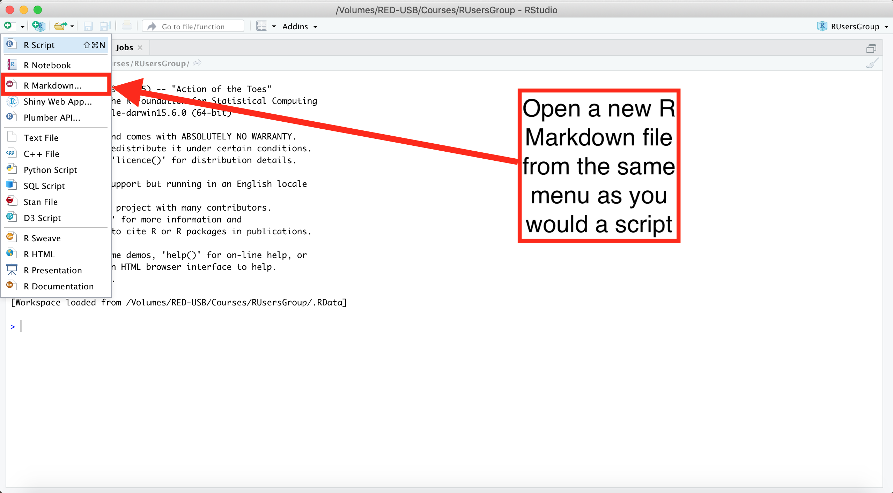

```{r setup, include=FALSE}
knitr::opts_chunk$set(echo = TRUE)
setwd("~/Markdown_Tutorial")
```


***

### What is R Markdown?

* R Markdown is a dynamic interface to __create reports__ in R
* Available directly in RStudio 
* Uses a simple syntax to format exported reports
* More information at [rmarkdown.rstudio.com](rmarkdown.rstudio.com)

***

### Why should I work in R Markdown when R Script works just fine?

* Allows the export of R workspaces to various file formats (Word, HTML, PDF, etc)
* Helps keep code organized in the R workspace
* Simplifies writing explanations of methods used in R

***

### Getting Started in R Markdown

```{r open, echo=FALSE, out.width=100%}

```

***


***

### Working in R Markdown

* Writing scripts in R Markdown is very similar to working with an R Script. 
* R code gets embedded into "chunks" in the R markdown file that can be formatted to your export needs.
  * Each chunk is formatted individually, so we can change the output based on what we are coding
* There are keyboard shortcuts for inserting code chunks
  * Mac users: control-option-i __or__ command-option-i
  * PC users: control-alt-i
* Chunks of other coding languages (bash, SQL, Python, etc) can also be inserted into the same R Markdown file

***
#### Chunk in R Markdown (not exported)


```{r Sample Chunk 1, echo=FALSE}
# This grey area is a chunk and works just like an R script
# We need to use # to make comments inside the chunk, but not outside the chunk
```

#### Chunk in R Markdown (exported)
```{r Sample Chunk 2}
# This is what an exported code chunk looks like
data("mtcars")
```

***
#### Chunk in R Markdown (exported with output)
```{r Sample Chunk 3}
head(mtcars)
```


***

#### Plots in R Markdown
* Plots, as with other R outputs, will appear below the code chunk where code is located
  * This applies to both the R workspace and the knit file
* Can specify in the chunk header whether or not to include the code in the knit file

***

```{r plots 1}
plot(mtcars$mpg~mtcars$cyl)
```

***

#### Inline coding
* If you would like to include R outputs within the knit text, inline coding may be an option
* What is the product of 2^2^? 
  * The answer is `r 2^2`
* Simply typing the answer is possible, but coding it in simplifies creating the report for more complex problems


***
### Final thoughts

* There are ~~not any~~ resources available to help with the markdown syntax
  * See R Markdown cheat sheet
* You don't _have_ to create reports with every R Markdown file
* Mac users: you _may_ need to download __XQuartz__ for PDF export formats
* Have FUN!

